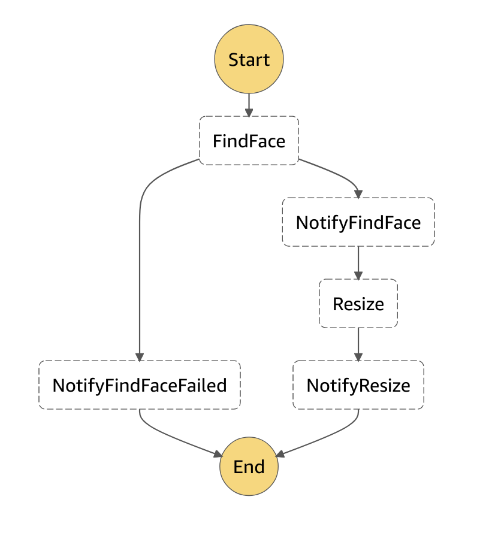
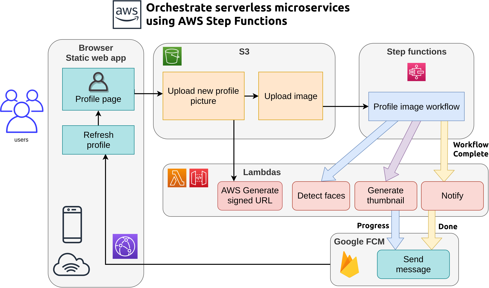

# Detect faces workflow

AWS Step Functions workflow for invoking AWS Lambdas to detect face and smile using uploaded images.
Activated using [S3 Listener](https://github.com/huksley/aws-s3-listener/) when profile image gets uploaded to S3

## Workflow

## Architecture

## Components

- [aws-profile-form](https://github.com/huksley/aws-profile-form/) This static webapp for uploading profile pictures.
- [aws-detect-faces-function](https://github.com/huksley/aws-detect-faces-function/) AWS Lambda to detect face
- [aws-resize-function](https://github.com/huksley/aws-resize-function/) Resizes and crops to face using NodeJS sharp library
- [aws-upload-handler](https://github.com/huksley/aws-upload-handler/) Creates presigned form URLs for image upload
- [aws-messaging](https://github.com/huksley/aws-messaging/) Handles async messaging and data updates via Google FCM
- [aws-s3-listener](https://github.com/huksley/aws-s3-listener/) Listens to S3 image uploads and fires AWS Step Functions workflow
- [aws-detect-faces-workflow](https://github.com/huksley/aws-detect-faces-workflow) Workflow for step functions definition
